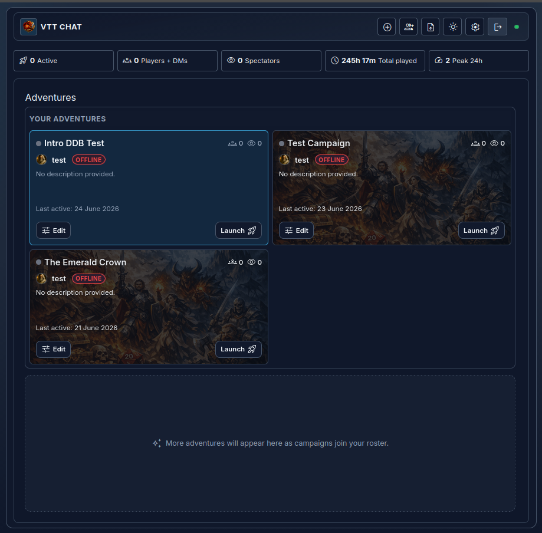
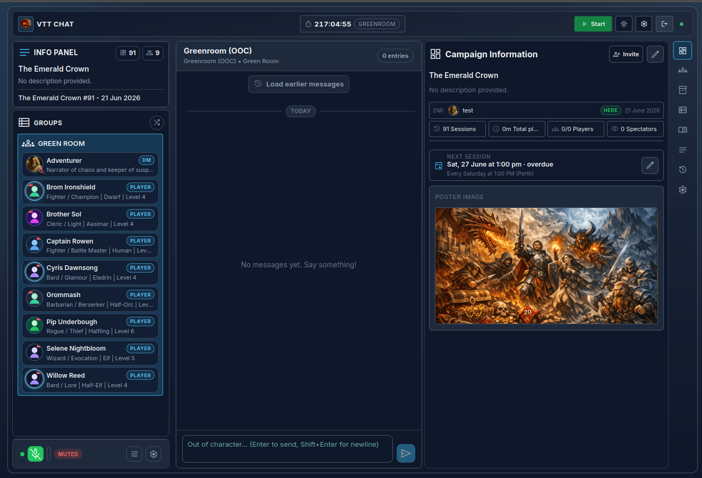
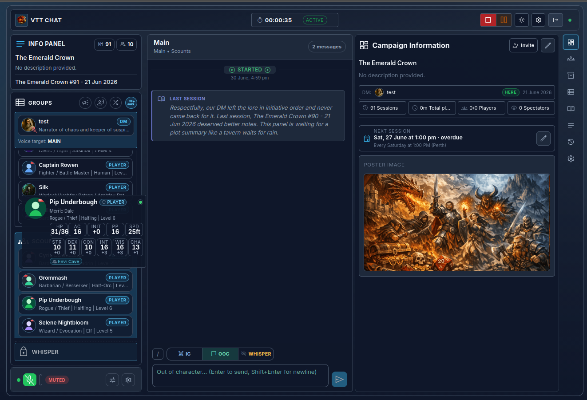
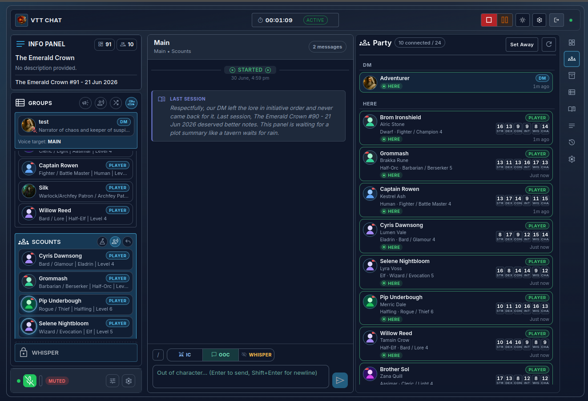
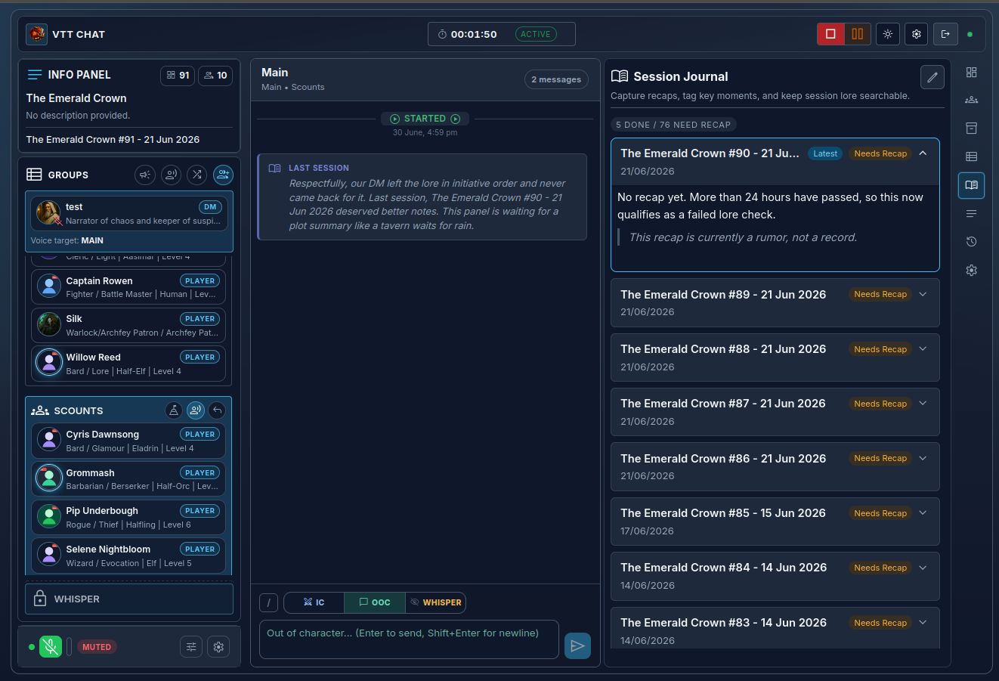
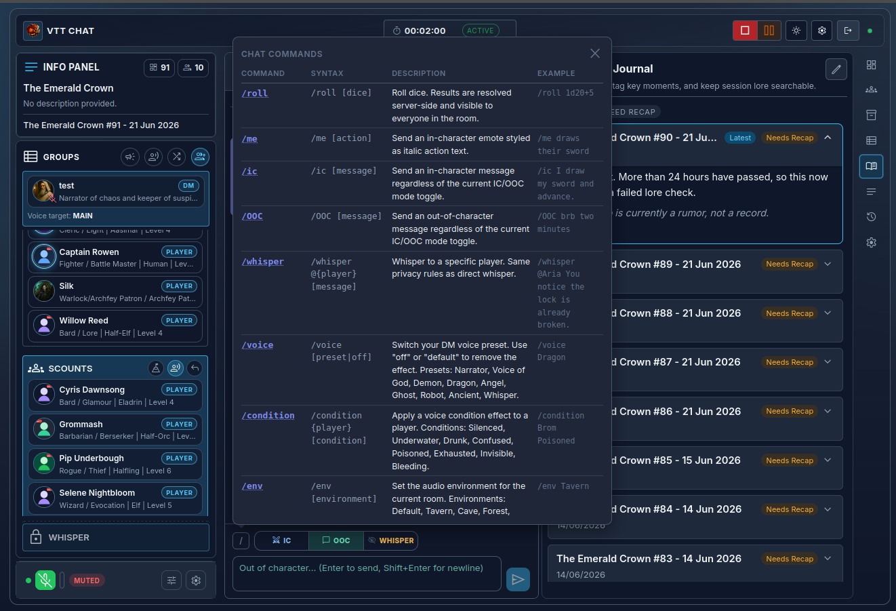

# VTT-Chat

> A DM-grade, session-aware voice and chat platform built specifically for tabletop RPGs — because Discord was never designed for this.

<!--
Build and release status badges will be enabled once CI workflows are activated.

[](https://github.com/AndyProsser/vtt-chat/actions/workflows/backend-ci.yml)
[](https://github.com/AndyProsser/vtt-chat/actions/workflows/frontend-ci.yml)
[](https://github.com/AndyProsser/vtt-chat/actions/workflows/release.yml)
-->

**Version:** 0.9.6 — active development, not yet production-ready\
**Status:** Core platform feature-complete through stage 15. Current work: inventory, extension DM-link, audio polish, performance — see [ROADMAP.md](ROADMAP.md) and [docs/DEVELOPMENT-ROADMAP.md](docs/DEVELOPMENT-ROADMAP.md)\
**Release notes:** [CHANGELOG.md](CHANGELOG.md)

---

## Screenshots

> The Emerald Crown — a live campaign at session 91.

**Campaign dashboard** — manage all your campaigns from one place, with at-a-glance stats on active sessions, total playtime, and peak concurrent players.



---

**Greenroom (pre-session)** — the DM's staging area before the session starts. Full party roster with character class, race, level, and role badges. Campaign info, poster art, and next-session scheduling on the right.



---

**Active session — character hover card** — hover any player in the groups panel to see their full stat block: HP, AC, Initiative, passive Perception, speed, and all six ability scores. The "LAST SESSION" lore card reminds the DM of where things left off.



---

**Active session — party panel** — a full party view with every player's character name, player name, race, class, level, all six ability scores, and live presence indicators.



---

**Session journal** — searchable session history across every session of the campaign. Each entry can hold a recap; overdue entries are flagged so nothing gets lost.



---

**Chat commands** — slash commands for in-character emotes, dice rolls, whispers, DM voice presets, audio environments, and player conditions — all server-resolved and visible to the right audience.



---

## What Is VTT-Chat?

VTT-Chat is a self-hostable communication platform designed from the ground up for tabletop role-playing games. It replaces the awkward combination of Discord voice, browser tabs, and scattered notes that most groups cobble together.

The platform is built around how tabletop sessions actually work:

- The **DM has full authority** — over the session, audio, presence, and what spectators can see.
- **Roles are first-class citizens** — DM, Player, and Spectator each have a tailored experience with explicit, documented permission boundaries.
- **Privacy is enforced by design** — whispers stay private, DM notes are never exposed, and spectators cannot access the green room.
- **Sessions have a lifecycle** — green room → active session → recap window, with state persisted through reconnects and network drops.
- **Characters are first-class citizens** — ability scores, class, race, level, HP, and inventory sync live from D&D Beyond via the browser extension. No manual re-entry.
- **Audio is built in** — ambient environments (Tavern, Cave, Forest, Underwater…), per-player voice conditions (Silenced, Whisper, Dragon…), and broadcast/voice-of-god — all DM-controlled per room, per player, in two clicks.
- **The session journal keeps the campaign alive** — every session is logged, searchable, and flagged for recap so nothing gets lost across 90+ sessions.

VTT-Chat is designed for groups that play regularly and want something that feels native to the hobby, not bolted together from general-purpose tools.

---

## Why Not Discord?

Discord is a fantastic general-purpose voice and chat tool. It was not designed for TTRPGs. Specifically, it lacks:

- **DM-controlled session gating** — you cannot lock a voice channel to session-only access, or meaningfully separate "at the table" from "watching from the sidelines".
- **Role-aware chat** — in-character and out-of-character messages live in the same stream. Whispers are channel invites.
- **Integrated notes and audio** — ambient sound, trigger effects, and shared notes require third-party bots or separate apps.
- **VTT integration** — there is no first-party bridge between your character sheet and your voice channel.
- **Spectator support** — there is no concept of a read-only observer who can watch a session without being a full participant.

VTT-Chat is what Discord would be if it was purpose-built for tabletop games.

---

## How It Works

```text
Browser Extension (D&D Beyond / Roll20 / Foundry)
      |  scrapes identity + character data
      v
  VTT-Chat Frontend (React SPA)
      |  WebSocket + REST
      v
  VTT-Chat Backend (Node.js / Express)
      |
      +-- PostgreSQL  — persistent campaign, session, chat, and notes state
      +-- Redis       — ephemeral presence, session bus, pub/sub
      +-- LiveKit     — real-time voice and audio routing
```

Players and DMs connect via the web app and the browser extension. The extension scrapes identity and character data from supported VTTs (D&D Beyond first; Roll20 and Foundry planned) and authenticates users automatically using a per-campaign invite code — no manual account creation required. Your VTT account is the credential.

Spectators join via a separate web-only invite page. No extension or VTT account is required to watch.

---

## Tech Stack

| Layer             | Technology                                |
| ----------------- | ----------------------------------------- |
| Frontend          | React 19, Vite, Zustand, TypeScript       |
| Backend           | Node.js, Express 5, TypeScript            |
| Realtime          | WebSocket (`ws`), LiveKit (voice + audio) |
| Database          | PostgreSQL (via Prisma ORM)               |
| Cache / Bus       | Redis                                     |
| Reverse proxy     | Caddy (automatic HTTPS)                   |
| Containers        | Docker + Docker Compose                   |
| Browser extension | Separate repo — see below                 |

---

## Design Philosophy

VTT-Chat is built on four principles:

1. **DM authority is absolute.** The DM starts and ends sessions, controls audio, manages presence, and sets spectator policy. Nothing overrides this.
2. **Roles before features.** Every capability is defined by role (DM, Player, Spectator), not by feature flags. The [Permissions Matrix](docs/architecture/PERMISSIONS-MATRIX.md) is the authoritative reference.
3. **Privacy by default.** Whispers, DM notes, and green room state are never exposed to unauthorised roles — enforced server-side, not just hidden in the UI.
4. **Deterministic state.** All state changes flow through typed events and deterministic reducers. There are no side-effects outside the defined event pipeline.

See [docs/philosophy/](docs/philosophy/) for the full philosophy documentation.

---

## Repository Structure

```text
vtt-chat/
  backend/    — Node.js/Express API, WebSocket server, Prisma schema
  frontend/   — React SPA (player/DM client)
  admin/      — React SPA (sysadmin panel)
  shared/     — Shared TypeScript types, event contracts, validators
  docs/       — Full architecture, design, and API documentation
  infra/      — Deployment/runtime infrastructure configs and helper scripts
```

The browser extension lives in a separate repository: **[AndyProsser/vtt-chat-extension](https://github.com/AndyProsser/vtt-chat-extension)**

---

## Platform Support

Linux is the supported runtime target for both server and development workflows.

| Workflow                    | Supported Linux platforms              | Recommended             |
| --------------------------- | -------------------------------------- | ----------------------- |
| **PROD (server/admin)**     | Ubuntu Server (primary support target) | Ubuntu LTS 24.x or 26.x |
| **DEV (local development)** | Ubuntu/Debian, Fedora, CachyOS/Arch    | Ubuntu LTS 24.x or 26.x |

Editor recommendation: **VS Code**.

Notes:

- PROD quick start in this README assumes Ubuntu Server and the `/opt/vtt-chat` deployment path.
- DEV quick start assumes a cloned repo and uses in-repo commands (`./install --dev ...`, `./server --dev ...`).

---

## Quick Start — Self-Hosting on Ubuntu Server

VTT-Chat is designed to run on a home server or small VPS. The `infra/scripts/install.sh` script handles prerequisites and initial configuration on Ubuntu Server 22.04+.

**Before you start, you will need:**

- A domain name pointing at your server (Caddy handles automatic HTTPS)
- Ports **8443/TCP** (HTTPS), **7880/TCP** (LiveKit), and **7881–7980/UDP** (LiveKit media) open in your firewall or router

### 1. Run the installer

```bash
curl -fsSL https://raw.githubusercontent.com/AndyProsser/vtt-chat/main/infra/scripts/install.sh | sudo bash -s setup
```

This installs Docker and firewall prerequisites, stages the runtime in `/opt/vtt-chat`, and writes a config file at `/opt/vtt-chat/infra/install-config.yml`.

### 2. Edit the config

```bash
sudo nano /opt/vtt-chat/infra/install-config.yml
```

Set your domain name at minimum. Passwords marked `auto` are generated randomly on first run.

### 3. Build and manage the stack with `./server`

```bash
cd /opt/vtt-chat
./server doctor
./server build
./server start
```

VTT-Chat will be available at `https://your-domain:8443`.

For ongoing admin operations, use:

```bash
cd /opt/vtt-chat
./server status
./server restart
./server stop
./server update
./server clean
```

For full setup details, reverse-proxy configuration, and upgrade instructions see [docs/operations/](docs/operations/).

---

## Developer Quick Start

See [DEVELOPING.md](DEVELOPING.md) for the full setup guide (Linux/Ubuntu focused). The short version:

**Requirements:** Node.js 26, Docker, Docker Compose

```bash
git clone https://github.com/AndyProsser/vtt-chat.git
cd vtt-chat
./install --dev check
./install --dev setup

# build and manage DEV stack using tested compose/caddy/livekit configs
./server --dev doctor
./server --dev build
./server --dev start
./server --dev status
```

The web app is served through Caddy on a single web entrypoint:

- DEV: `http://localhost:8080`
- PROD: `https://your-domain:8443` (or your configured HTTPS port)

Backend/frontend/admin service ports (`3000`, `5173`, `5174`) are internal container ports used inside the Docker network.

Database exposure by mode:

- DEV: PostgreSQL is exposed for local tooling (default host port `5432`)
- PROD: PostgreSQL is not exposed publicly; it remains internal to the Docker network

Operator note: backend container startup wait/retry and Prisma schema sync behavior is documented in [backend/README.md#container-startup-db-wait-schema-sync-and-failure-behavior](backend/README.md#container-startup-db-wait-schema-sync-and-failure-behavior). For container health state details, see [Container Health Checks](#container-health-checks) below.

---

## Container Health Checks

All services in both dev and production environments include healthchecks so Docker Compose and orchestrators can track readiness state. Services wait for their dependencies to be healthy before starting.

| Container      | Internal Port | Check Target                            | What It Verifies                              |
| -------------- | ------------- | --------------------------------------- | --------------------------------------------- |
| **Backend**    | 3000          | HTTP `GET /health`                      | App is running and can respond to requests    |
| **Frontend**   | 5173          | HTTP `GET /`                            | Vite dev server (dev) or built SPA is serving |
| **Admin**      | 5174          | HTTP `GET /`                            | Admin dashboard is serving                    |
| **PostgreSQL** | 5432          | `pg_isready`                            | Database is accepting connections             |
| **Redis**      | 6379          | `redis-cli PING`                        | Cache/bus is responding                       |
| **LiveKit**    | 7880          | HTTP `GET /` (expects OK)               | WebRTC signaling server is responsive         |
| **Caddy**      | 8080/8443     | HTTP `GET http://127.0.0.1:2019/config` | Reverse proxy admin API is responsive         |

External web access is via Caddy only (single web port):

- DEV: `http://localhost:8080`
- PROD: `https://<domain>:<https_port>` (default `8443`)

Note: In DEV, PostgreSQL is exposed on the host for local tooling. In PROD, PostgreSQL is not exposed on a public host port.

**Check status in a running stack:**

```bash
# Show all container health status
docker compose ps

# Watch real-time health changes
docker compose ps --watch

# Inspect a specific container's health
docker inspect vttchat-backend-dev | jq '.[] | .State.Health'
```

All services use reasonable startup periods and retry counts. If a service shows `unhealthy`, check container logs:

```bash
docker compose logs <service-name>
```

---

## Documentation

The full documentation suite lives in [`docs/`](docs/README.md) and covers architecture, API specification, data model, permissions, subsystem behaviour, and the extension integration.

Key entry points:

| Document                                                                               | Purpose                               |
| -------------------------------------------------------------------------------------- | ------------------------------------- |
| [docs/README.md](docs/README.md)                                                       | Full documentation index              |
| [ROADMAP.md](ROADMAP.md)                                                               | Testing and operatisation roadmap     |
| [docs/DEVELOPMENT-ROADMAP.md](docs/DEVELOPMENT-ROADMAP.md)                             | Development roadmap and stage history |
| [CHANGELOG.md](CHANGELOG.md)                                                           | Release history                       |
| [docs/architecture/ARCHITECTURE-DIAGRAM.md](docs/architecture/ARCHITECTURE-DIAGRAM.md) | System structure overview             |
| [docs/architecture/PERMISSIONS-MATRIX.md](docs/architecture/PERMISSIONS-MATRIX.md)     | Role capability reference             |
| [docs/architecture/API-SPEC.md](docs/architecture/API-SPEC.md)                         | REST and WebSocket API                |
| [docs/extension/GUEST-AUTH.md](docs/extension/GUEST-AUTH.md)                           | Extension auth and invite flow        |
| [DEVELOPING.md](DEVELOPING.md)                                                         | Developer environment setup           |

---

## Contributing

Contributions are welcome. Before opening a pull request:

1. Read [DEVELOPING.md](DEVELOPING.md) for environment setup.
2. Check [ROADMAP.md](ROADMAP.md) for current testing/operatisation focus and [docs/DEVELOPMENT-ROADMAP.md](docs/DEVELOPMENT-ROADMAP.md) for feature-stage history.
3. Follow the existing code style (ESLint + Prettier, enforced by CI).
4. Add or update tests for any changed behaviour.
5. Keep PRs focused — one concern per PR.

For larger changes or new features, open a discussion issue first so the design can be agreed before implementation starts.

**[Submit a bug report or feature request →](https://github.com/AndyProsser/vtt-chat/issues)**
**[Open a pull request →](https://github.com/AndyProsser/vtt-chat/pulls)**

See [docs/meta/CONTRIBUTING.md](docs/meta/CONTRIBUTING.md) for the full contribution guide and [docs/meta/ONBOARDING.md](docs/meta/ONBOARDING.md) for new contributor onboarding.

---

## Release and Versioning

This repository uses semantic-release with Conventional Commits to determine version bumps and generate release notes.

- Feature commits (`feat`) trigger minor releases.
- Fix/documentation/refactor commits (scoped) trigger patch releases.
- Release notes are written to [CHANGELOG.md](CHANGELOG.md).

Version maintenance rules:

1. `package.json` is the canonical project version.
2. `backend/package.json`, `frontend/package.json`, `admin/package.json`, and `shared/package.json` must match the root version.
3. The version line in this README must match the latest released version.

See [docs/meta/RELEASE-PLAN.md](docs/meta/RELEASE-PLAN.md) for commit scopes, release buckets, and message templates.

---

## Code of Conduct

This project follows the [Contributor Covenant Code of Conduct](CODE_OF_CONDUCT.md). By participating you agree to abide by its terms.

---

## Third-Party IP Notice

VTT-Chat is a fan project created by players who love Dungeons & Dragons. It is not affiliated with, endorsed by, or intended to compete with Wizards of the Coast LLC or D&D Beyond.

The browser extension reads D&D Beyond data to provide seamless authentication and character sync. This is done via unofficial, undocumented APIs — full details on what data is accessed and how it is used are in the [extension repository](https://github.com/AndyProsser/vtt-chat-extension) and its documentation.

We have no intention of infringing on Wizards of the Coast's intellectual property or negatively impacting D&D Beyond. We are fans who simply want to create a more immersive chat experience for players to enjoy the game they love. If an official API becomes available, we would be delighted to migrate to it or to contribute to its development. If Wizards of the Coast or D&D Beyond has any concerns, we are very open to discussion and happy to make whatever changes are needed — please reach out via [GitHub Issues](https://github.com/AndyProsser/vtt-chat/issues).

*Dungeons & Dragons and D&D Beyond are trademarks of Wizards of the Coast LLC.*

---

## License

[GNU AGPL v3.0](LICENSE)

Simple summary:

- You can use, run, and modify this app.
- You can share original or modified versions.
- If you distribute this app (or a modified version), you must keep it under AGPL and provide source code.
- If you run a modified version as a network service (for example, a hosted server others use), you must also make that modified source available to those users.
- This software is provided "as is" without warranty.

The full license text in [LICENSE](LICENSE) is the legal source of truth.
