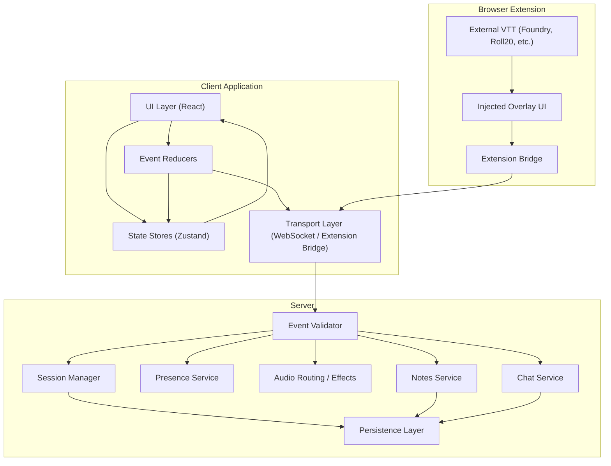
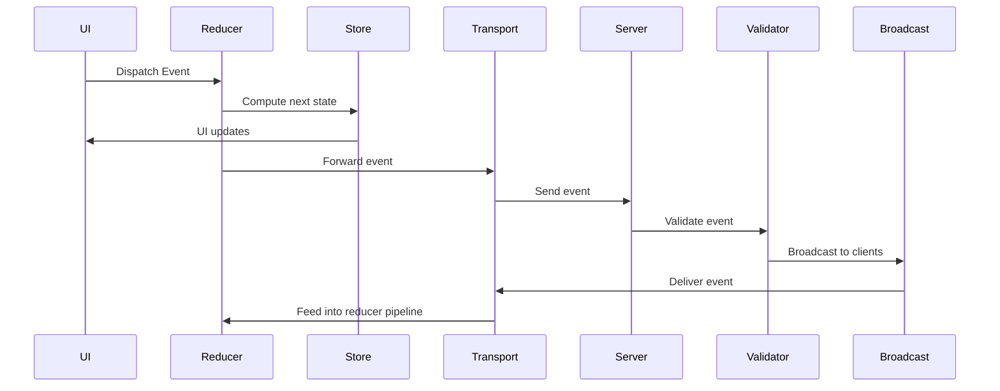
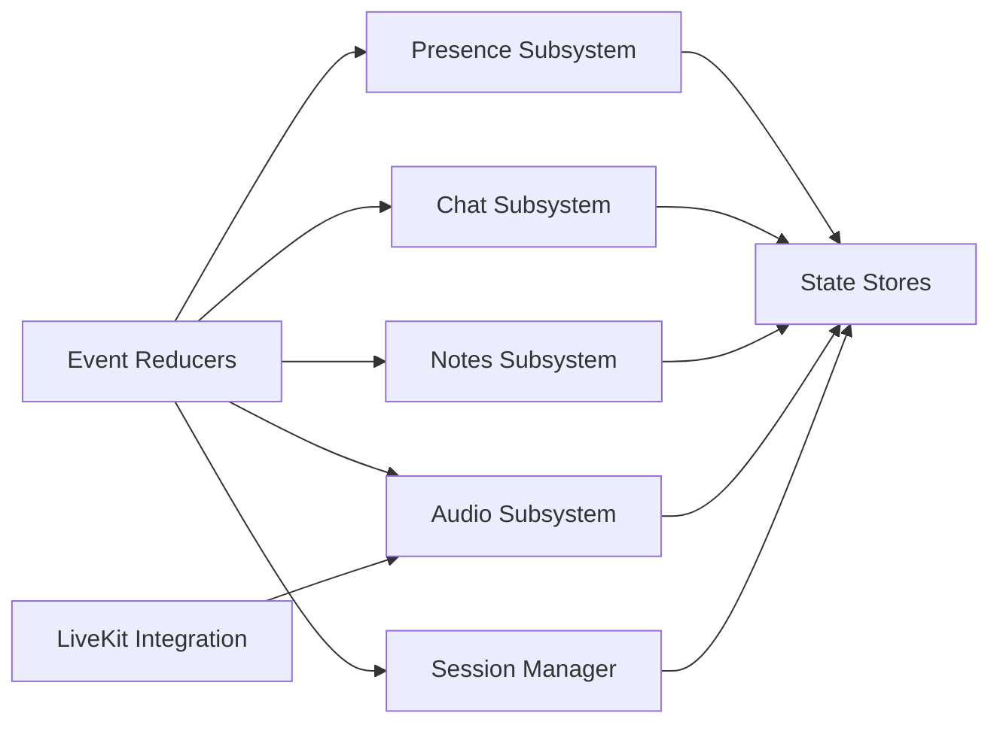
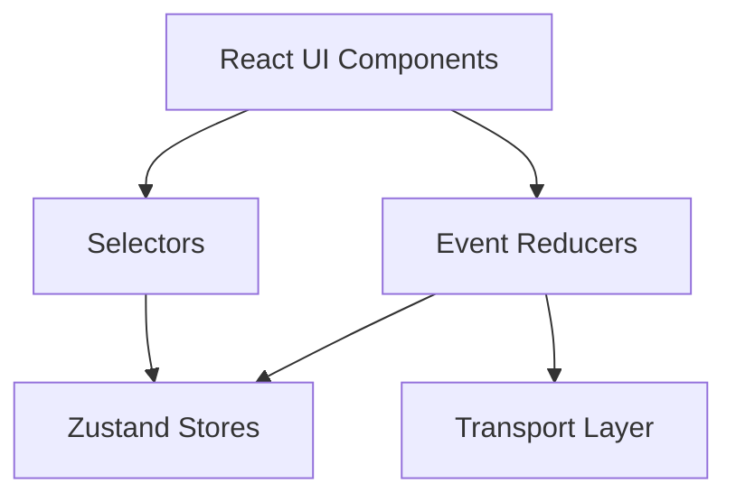
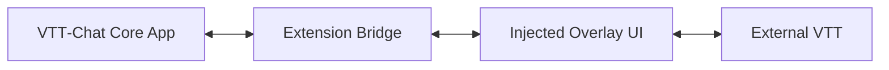
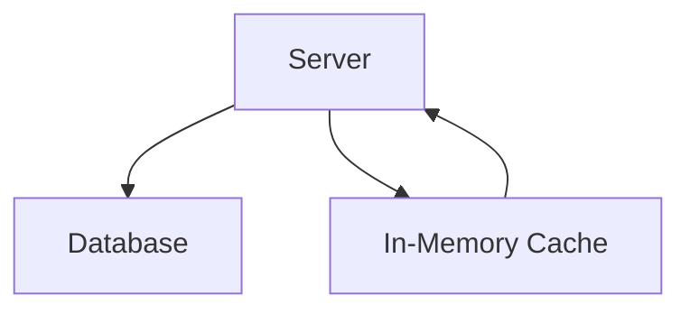

# **ARCHITECTURE-DIAGRAM.md**

# Architecture Diagram

This document provides a visual overview of the VTT‑Chat platform architecture.
It is designed to give developers a clear mental model of how the system is structured, how data flows, and how subsystems interact.

The diagrams below use **Mermaid** for readability and maintainability.
They are intentionally high‑level and conceptual, not implementation‑specific.

---

# 1. High‑Level System Overview

This diagram shows the major layers of the platform and how they relate.

---

# 2. Event Flow Diagram

This diagram illustrates the **unidirectional event flow** that powers the entire system.

Key points:

- Events always flow **UI → Reducer → Store → UI** locally
- Networked events flow **Reducer → Transport → Server → Broadcast → Reducer**
- Reducers are pure and deterministic
- Stores are the canonical client state

---

# 3. Subsystem Interaction Diagram

This diagram shows how subsystems depend on each other.

---

# 4. Client‑Side Architecture

This diagram focuses on the **frontend**.

Notes:

- UI reads state via **selectors**
- UI writes state via **reducers**
- Reducers are the only way to mutate state
- Transport sends events to the server or extension

---

# 5. Extension Architecture

This diagram shows how the browser extension integrates with the core app and the VTT.

Key points:

- The extension acts as a **bridge** between the core app and the VTT
- The overlay is injected into the VTT DOM
- The extension can read/write VTT state depending on permissions

---

# 6. Data Persistence Diagram

Persistence is used for:

- Notes
- Session metadata
- Chat logs (optional)
- User profiles
- Audio preset libraries

---

# 7. Summary

The architecture is designed to be:

- **Predictable** — unidirectional data flow
- **Modular** — subsystems are isolated
- **Extensible** — new subsystems can be added without breaking others
- **Transport‑agnostic** — works with WebSockets, extension bridges, or local dispatch
- **Debuggable** — reducers and events are fully traceable

This diagram serves as the visual foundation for understanding the entire platform.
