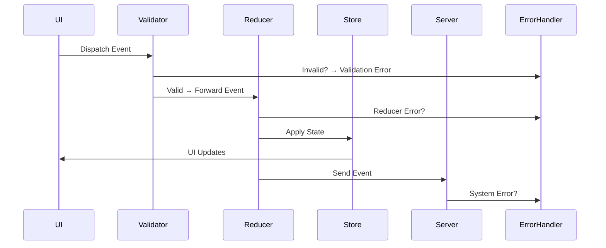

# Error Model

The Error Model defines how VTT‑Chat detects, classifies, reports, and recovers from errors across the entire platform.
It ensures that:

- Errors are predictable
- Errors never corrupt state
- Errors never leak private information
- Errors are visible to the right roles
- Errors are recoverable
- Errors do not break the unidirectional event flow

This document covers error categories, propagation rules, UI behaviour, reducer guarantees, and extension‑level considerations.

---

## 1. Core Principles

#### **1.1 Errors must never break the event pipeline**

Even when an error occurs, the system must remain:

- Connected
- Responsive
- Consistent

#### **1.2 Errors must never leak private data**

Error messages are sanitized before being shown to users.

#### **1.3 Errors must be role‑appropriate**

DMs see more detail than players.
Players see more detail than spectators.

#### **1.4 Errors must be recoverable**

The system must always be able to:

- Retry
- Rehydrate
- Reconnect
- Reset local state

#### **1.5 Errors must be observable**

Errors are logged for debugging and telemetry.

---

## 2. Error Categories

Errors are grouped into five categories.

---

### 2.1 Validation Errors

Triggered when:

- Event schema is invalid
- Payload is malformed
- Required fields are missing
- Types do not match
- Event type is unknown

Examples:

- Missing `payload.message`
- Invalid `actor`
- Unknown event domain

These errors are **never broadcast** to other clients.

---

### 2.2 Permission Errors

Triggered when:

- Actor attempts an action they are not allowed to perform
- Capability check fails
- Role boundary is violated

Examples:

- Player attempts to pause the session
- Spectator attempts to send a message
- Player attempts to delete another player’s note

These errors are visible only to the actor who triggered them.

---

### 2.3 Reducer Errors

Triggered when:

- Reducer logic throws
- State transition is invalid
- Event is incompatible with current state

Examples:

- Attempting to resume a session that is not paused
- Applying an audio preset that does not exist

Reducers must be pure, so reducer errors indicate:

- Invalid event
- Invalid state
- Developer error

These errors are logged and surfaced to developers in dev mode.

---

### 2.4 Transport Errors

Triggered when:

- WebSocket disconnects
- Extension bridge fails
- Network latency spikes
- Server is unreachable

Transport errors are:

- Automatically retried
- Automatically recovered
- Never fatal

UI shows a non‑blocking “Reconnecting…” banner.

---

### 2.5 System Errors

Triggered when:

- Server encounters an unexpected exception
- Database operation fails
- Internal invariant is violated

System errors:

- Are logged
- Are sanitized before being sent to clients
- Never expose stack traces to players

DMs may see a generic “System error occurred” message.

---

## 3. Error Propagation Rules

Errors follow strict propagation rules to maintain privacy and predictability.

---

### 3.1 Validation & Permission Errors

- Visible only to the actor
- Never broadcast
- Never applied to state
- Do not reach reducers

---

### 3.2 Reducer Errors

- Logged locally
- Do not mutate state
- Do not break the pipeline
- In dev mode: visible in console
- In production: silent fail + telemetry

---

### 3.3 Transport Errors

- Trigger reconnection logic
- UI shows connection status
- State is rehydrated after reconnect
- No user action required

---

### 3.4 System Errors

- Sanitized before reaching clients
- Never reveal internal details
- Logged server‑side
- May trigger fallback behaviour

---

## 4. Error Lifecycle

---

## 5. UI Error Behaviour

#### **Player UI**

- Shows friendly, non‑technical messages
- Never shows stack traces
- Never shows DM‑private information

#### **DM UI**

- Shows more detailed messages
- May include context (e.g., “Invalid transition: session already active”)
- Still sanitized

#### **Spectator UI**

- Shows minimal error feedback
- Never shows private or role‑restricted information

---

## 6. Extension Error Behaviour

The extension must:

- Fail gracefully
- Never break the VTT
- Never expose internal errors to the VTT
- Retry failed actions
- Surface errors only to the DM or actor

Examples:

- Overlay injection failure
- DOM read/write failure
- VTT API mismatch

---

## 7. Error Logging & Telemetry

Errors are logged at multiple layers:

- Client console (dev mode)
- Server logs
- Telemetry pipeline
- Extension logs

Logs include:

- Event type
- Actor
- Timestamp
- Error category
- Sanitized message

Logs never include:

- Private notes
- Whisper contents
- DM‑private data
- System internals

---

## 8. Recovery Strategies

The system uses several recovery strategies:

#### **8.1 Automatic Reconnect**

Triggered on transport failure.

#### **8.2 State Rehydration**

Triggered after reconnect.

#### **8.3 Event Replay**

Future feature for full determinism.

#### **8.4 Local Reset**

Triggered when local state becomes inconsistent.

#### **8.5 Server Fallback**

Triggered when a subsystem fails.

---

## 9. Developer Guidance

#### **Reducers must never throw**

All reducer errors indicate a bug.

#### **Events must be validated**

Never trust client payloads.

#### **UI must handle partial state**

Never assume state is fully loaded.

#### **Extension must sandbox operations**

Never assume VTT DOM is stable.

---

## 10. Summary

The Error Model ensures that:

- Errors are safe
- Errors are predictable
- Errors never leak private data
- Errors never corrupt state
- Errors never break the event pipeline
- Errors are recoverable
- Errors are observable

It is a foundational part of the platform’s reliability and trustworthiness.
