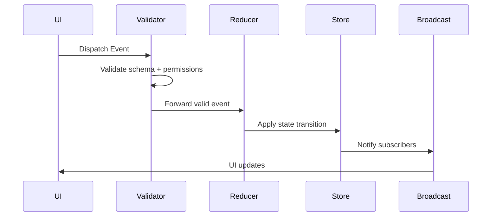

# **EVENT-BUS.md**

# Event Bus Architecture

Status:

- This document explains the event model conceptually and still contains older dotted/lowercase event-name examples.
- The shipped Stage 0-7 runtime contract uses the shared event envelope and uppercase event families defined in `shared/events/*`.
- For current runtime contracts, see [../README.md](../README.md#runtime-source-of-truth).

The Event Bus is the **central communication backbone** of the VTT‑Chat platform.
It defines how state changes, user actions, system events, and extension events flow through the system in a predictable, observable, and debuggable way.

The Event Bus is intentionally:

- **Unidirectional** — events flow in one direction
- **Deterministic** — same input → same output
- **Serializable** — every event is JSON‑safe
- **Transport‑agnostic** — works over WebSockets, extension bridges, or local reducers
- **Extensible** — new subsystems can register new event types

This document defines the event model, event lifecycle, validation rules, and subsystem responsibilities.

---

# 1. Core Principles

### **1.1 Events are the only way state changes**

No subsystem mutates state directly.
All state transitions originate from events.

### **1.2 Events are immutable**

Once dispatched, an event cannot be modified.

### **1.3 Events are declarative**

Events describe _what happened_, not _how to handle it_.

### **1.4 Events are validated before processing**

Invalid events never enter the reducer pipeline.

### **1.5 Events are logged and replayable**

This enables:

- State recovery
- Debugging
- Time‑travel inspection
- Session playback (future feature)

---

# 2. Event Structure

All events follow a strict schema:

```json
{
  "type": "string.event.name",
  "timestamp": 1710000000000,
  "actor": "userId | system",
  "payload": { ... }
}
```

### **Fields**

| Field       | Description                                       |
| ----------- | ------------------------------------------------- |
| `type`      | Namespaced event identifier (`chat.message.send`) |
| `timestamp` | Unix ms timestamp generated by the server         |
| `actor`     | User ID or `"system"`                             |
| `payload`   | Event‑specific data                               |

### **Event Type Naming Convention**

```
Canonical runtime: DOMAIN:ACTION
Conceptual notation (used in some design docs): <domain>.<subdomain>.<action>
```

Runtime contract note:

- Transported events in the current implementation use the Stage 0 `DOMAIN:ACTION` names
  defined in [CONTRACTS.md](../CONTRACTS.md).
- Dotted names in this document are conceptual aliases for readability.

Examples (conceptual alias → runtime contract):

- `chat.message.send` → `CHAT:MESSAGE_SENT`
- `notes.shared.update` → `NOTES:UPDATED`
- `audio.effect.trigger` → `AUDIO:EFFECT_APPLIED`
- `presence.status.update` → `PRESENCE:STATE_CHANGED`
- `session.start` → `SESSION:STARTED`
- `extension.overlay.inject` → extension-specific integration event

---

# 3. Event Lifecycle

The event lifecycle is consistent across all transports.



### **Lifecycle Stages**

1. **Dispatch**
   UI, extension, or system emits an event.

2. **Validation**
   - Schema validation
   - Permissions check
   - Role enforcement
   - Payload sanitization

3. **Reduction**
   Reducers compute the next state based on the event.

4. **State Update**
   Zustand stores apply the new state.

5. **Broadcast**
   Updated state is pushed to all subscribers.

6. **UI Update**
   React components re-render based on new state.

---

# 4. Event Domains

The Event Bus is organized into domains that map to subsystems.

Note: Event labels in the tables below are conceptual aliases. For contract and payload authority,
use [CONTRACTS.md](../CONTRACTS.md) and the `/shared/events` definitions.

### **4.1 Chat Events**

| Event                 | Description               |
| --------------------- | ------------------------- |
| `chat.message.send`   | User sends IC/OOC message |
| `chat.message.delete` | Delete message            |
| `chat.whisper.send`   | Private message           |

---

### **4.2 Notes Events**

| Event                  | Description         |
| ---------------------- | ------------------- |
| `notes.private.create` | Create private note |
| `notes.shared.update`  | Update shared note  |
| `notes.shared.delete`  | Delete shared note  |

---

### **4.3 Audio Events**

| Event                  | Description          |
| ---------------------- | -------------------- |
| `audio.effect.trigger` | Trigger sound effect |
| `audio.preset.apply`   | Apply preset         |
| `audio.mute.player`    | Mute a player        |

---

### **4.4 Presence Events**

| Event                    | Description     |
| ------------------------ | --------------- |
| `presence.status.update` | Update presence |
| `presence.avatar.change` | Change avatar   |
| `presence.override`      | DM override     |

---

### **4.5 Session Events**

| Event            | Description    |
| ---------------- | -------------- |
| `session.start`  | Start session  |
| `session.end`    | End session    |
| `session.pause`  | Pause session  |
| `session.resume` | Resume session |

---

### **4.6 Extension Events**

| Event                      | Description             |
| -------------------------- | ----------------------- |
| `extension.overlay.inject` | Inject overlay into VTT |
| `extension.vtt.action`     | Trigger VTT action      |
| `extension.vtt.state.read` | Read VTT state          |

---

# 5. Validation Layer

Validation ensures:

- Event schema is correct
- Actor has permission
- Payload is safe
- Event type is recognized
- Subsystem is enabled

Invalid events:

- Are rejected
- Do not reach reducers
- Produce a system error event

---

# 6. Reducer Layer

Reducers are pure functions:

```
(nextState, event) = reducer(currentState, event)
```

Rules:

- No side effects
- No async operations
- No direct UI manipulation
- No network calls

Reducers are grouped by domain:

- `chatReducer`
- `notesReducer`
- `audioReducer`
- `presenceReducer`
- `sessionReducer`
- `extensionReducer`

---

# 7. State Stores

The Event Bus feeds into Zustand stores.

Stores:

- Hold the canonical client state
- Subscribe to reducer outputs
- Expose selectors to the UI
- Are the only source of truth for UI rendering

---

# 8. Transport Layer

The Event Bus is transport‑agnostic.

Supported transports:

- WebSockets
- Extension bridge
- Local UI dispatch
- System‑generated events

All transports normalize events into the same schema.

---

# 9. Debugging & Tooling

The Event Bus supports:

- Event logging
- Event replay
- Time‑travel debugging
- Session playback (future)
- DevTools integration

---

# 10. Extensibility

New subsystems can register:

- New event types
- New reducers
- New validation rules

The Event Bus is designed to scale with the platform.
