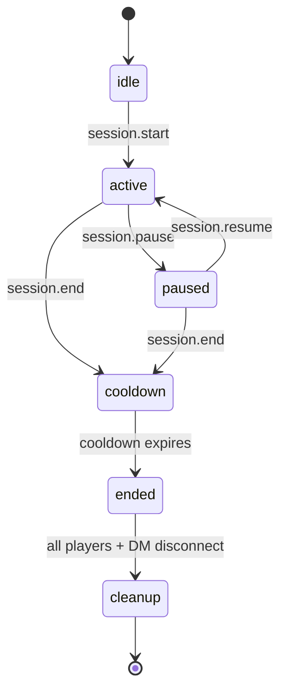
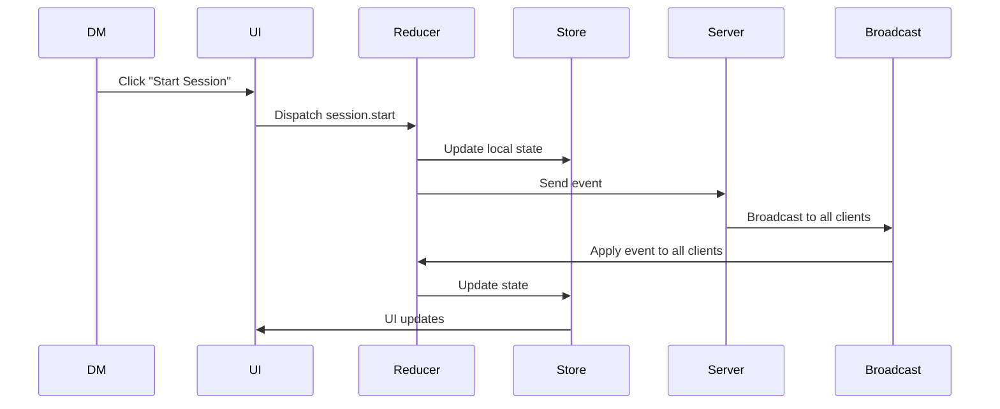
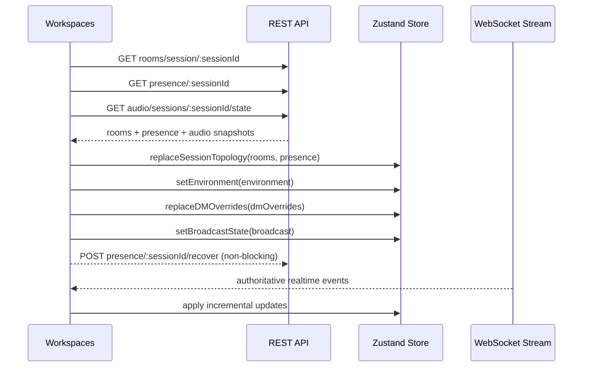

# Session Lifecycle

The Session Lifecycle defines how a tabletop session moves through its various states, how transitions occur, and which actors have authority over those transitions.
It is the authoritative reference for:

- Session state management
- DM controls
- Player visibility
- Event sequencing
- State recovery
- UI behaviour

The lifecycle is intentionally simple, predictable, and resilient to reconnection or transport failures.

---

## 1. Core Principles

### **1.0 Authority split: campaign vs session**

Lifecycle behavior follows an explicit authority split:

- Campaign membership + role determine whether a user can participate in conversation surfaces.
- Session state determines room assignment, lifecycle policy gates, and recording boundaries.
- Session transitions may move users between rooms but do not, by themselves, grant conversation authority.
- Audio transport continuity may survive session transitions; policy overlays still enforce whisper/spectator/privacy constraints.

### **1.1 Sessions are state machines**

A session always exists in exactly one state.

### **1.2 DM owns lifecycle transitions (with cooldown fallback controls)**

Players and spectators cannot start, pause, resume, or end sessions.
During `COOLDOWN`, players may control cooldown (`extend` / `end`) only when the DM is disconnected.

### **1.3 State transitions are event‑driven**

All transitions occur through events such as:

- `session.start`
- `session.pause`
- `session.resume`
- `session.end`
- `session.cooldown.extend`
- `session.cooldown.end`

### **1.4 State is recoverable**

Clients can reconnect at any time and reconstruct the current session state.

### **1.5 State is visible to all**

All participants can see the current session state, regardless of role.

### **1.6 Recording boundaries remain session-authoritative**

Even when transport/audio remains continuous, session lifecycle remains authoritative for recording and transcript boundaries.

- Session boundary bookends (`Started`, `Paused`, `Resumed`, `Ended`) are durable and required.
- Runtime policy during `PAUSED`/Whisper remains off-the-record unless explicitly configured otherwise.

---

## 2. Session States

The session state machine consists of six states.

### **2.1 inactive (idle in current codebase)**

The table is in greenroom mode and no live session is running.

- `IDLE` is reusable only for a never-started draft session.
- If a session has previously reached `ENDED`, it is no longer eligible to return to active use.

- The INACTIVE timer starts at `00:00` when the first DM/player joins greenroom membership.
- This timer represents readiness time for the next session, not time since the previous session ended.
- No timer popper is shown in this state.
- Players may chat.
- Notes may be created.
- Audio may be triggered.

---

### **2.2 active**

A session is currently running.

- On `IDLE -> ACTIVE`, the active session timer resets to `00:00`.
- Active elapsed time is backend-authoritative and shared across all clients.
- Active elapsed time must survive disconnects and page refreshes.
- Session chat is scoped to the session and includes only messages from this session.
- Campaign Greenroom chat remains visible as a separate, persistent context (campaign-scoped, survives session boundaries).
- Presence indicators are active.
- Audio effects may be synchronized.
- Session‑specific UI is enabled.
- DM tools are fully available.

---

### **2.3 paused**

The session is temporarily halted.

- The topbar primary timer switches to paused elapsed duration and uses a paused-specific color.
- Active elapsed timer continues in the background and remains visible in the timer popper.
- Pause totals are cumulative (`totalPausedDuration` + `pauseCount`).
- Presence indicators remain active.
- UI displays a paused banner.
- Players cannot trigger session‑critical actions.
- Pause runtime content defaults to off-the-record (ephemeral; cleared during cleanup).
- DM can toggle pause-runtime chat persistence at campaign level:
  - Default: ephemeral-only runtime content during `PAUSED`.
  - Optional override: persist pause-runtime chat to session history.
  - Voice/transcript recording rules remain governed by recording policy.
- Resume returns the session to `ACTIVE` with all effects and state restored.

---

### **2.4 cooldown**

The session has ended and players/DM are in a structured post-game cooldown window.

- All players are in the `MAIN` room (same audio/presence space).
- A session-end bookend (`[Session Ended]`) is inserted into chat.
- Only OOC (out-of-character) chat is allowed; IC chat is disabled.
- Players can view full session chat history and interact post-game.
- Spectators can chat and speak with the table during cooldown (elevated post-session interaction mode).
- All chat during cooldown is ephemeral by default and will be cleared during cleanup.
  - DM can toggle: persist or clear cooldown chat per campaign.
  - Default: ephemeral and not persisted to campaign history.
- DM audio effects are frozen (no new effects, conditions, or environment changes allowed).
- DM cannot create, delete, or move groups during cooldown.
- Topbar timer displays a cooldown countdown (`remainingCooldown -> 00:00`).
- Default cooldown is 1 minute; configurable range is 1 to 15 minutes per campaign.
- DM can extend cooldown (adds one more configured block, up to 3 extensions per session).
- When cooldown expires, the session auto-transitions to `ENDED`.

---

### **2.5 ended**

The live session and cooldown have concluded.

- The session is archive-locked and can never be restarted.
- On `COOLDOWN -> ENDED`, participants are transitioned back to Greenroom membership via room transition orchestration.
- All participants remain connected but in a post-session state.
- No new activities are possible (no chat, no audio effects, no group changes).
- Participants are still rendered in the room state with presence indicators.
- The session remains in `ENDED` state until all players and DM disconnect.
- Once all DM/player table members disconnect, a 60 second buffer starts. If none reconnect during that buffer, the session transitions to `CLEANUP`. Spectators do not block this transition.
- The next time a DM or player returns to this campaign, a new IDLE session is automatically created.

---

### **2.6 cleanup**

The session is fully archived and all runtime session-scoped data is purged.

- Cleanup runs after all players and DM have disconnected from the `ENDED` session and the 60 second disconnect buffer has elapsed.
- Cleanup purges session-scoped runtime data:
  - Whisper Bubble chat (ephemeral, off-the-record).
  - Paused runtime chat (if marked ephemeral by DM).
  - Cooldown runtime chat (if marked ephemeral by DM).
  - Any other ephemeral session-scoped message context.
- Campaign Greenroom chat is NOT purged (it is campaign-scoped, not session-scoped, and persists across sessions).
- Cleanup is terminal for that session record.
- A new IDLE session is created the next time a DM or player reconnects to the campaign.

---

## 3. Session Events

All session transitions are triggered by events.

| Event                     | Description                                                          | Actor                                 |
| ------------------------- | -------------------------------------------------------------------- | ------------------------------------- |
| `session.start`           | Begin a new session or activate a never-started draft session        | DM                                    |
| `session.pause`           | Pause the running session (ACTIVE → PAUSED)                          | DM                                    |
| `session.resume`          | Resume a paused session (PAUSED → ACTIVE)                            | DM                                    |
| `session.end`             | End the session and enter cooldown (ACTIVE or PAUSED → COOLDOWN)     | DM                                    |
| `session.cooldown.extend` | Extend cooldown by one configured block                              | DM; PLAYER only if DM is disconnected |
| `session.cooldown.end`    | End cooldown early (COOLDOWN → ENDED)                                | DM; PLAYER only if DM is disconnected |
| (auto)                    | Cooldown timer expires, transition to ENDED (COOLDOWN → ENDED, auto) | System                                |
| (auto)                    | All disconnect, transition to CLEANUP (ENDED → CLEANUP, auto)        | System                                |

Events are validated by:

- Role permissions
- Current session state
- Payload schema

Invalid transitions are rejected.

---

## 4. Event Flow

Key points:

- Local state updates immediately for responsiveness
- Server broadcast ensures global consistency
- Reducers guarantee deterministic transitions

---

## 5. UI Behaviour by State

### **inactive**

- “Start Session” button visible to DM.
- Topbar timer visible and counting elapsed time since first DM/player joined greenroom membership.
- Timer popper is hidden/disabled in this state.
- Session controls are otherwise idle.

### **active**

- Topbar timer shows active elapsed session time.
- Timer popper is available and live-updating while open.
- DM tools enabled.
- Player UI fully interactive.

### **paused**

- Paused banner visible.
- Topbar primary timer switches to paused elapsed time (distinct paused color).
- Active elapsed timer continues and is visible in popper details.
- Player actions restricted.

### **ended**

- Topbar timer shows elapsed-ended timing while remaining in `ENDED`.
- State pill displays canonical session state (`ENDED`) without aliasing.
- Timer popper remains available and shows final session timing summary (start, end, pause totals).
- Cooldown controls are not shown in `ENDED` (they are only available during `COOLDOWN`).
- Starting a new session is disabled while this session remains in `ENDED`.

### **cooldown**

- Topbar timer shows cooldown countdown (`remainingCooldown -> 00:00`).
- Cooldown controls are visible for DM.
- Player cooldown controls unlock only when DM is disconnected.
- Cooldown completion auto-transitions to `ENDED`; manual cooldown end follows the same transition.

---

## 5.3 Lifecycle Notifications

- Do not show success popups for session lifecycle transitions (`start`, `pause`, `resume`, `end`).
- Lifecycle state changes are communicated via chat bookends and persistent in-surface visual state.
- Error and warning toasts remain enabled for failed actions, degraded sync, and recovery prompts.

---

## 5.2 Cleanup Scheduling

`CLEANUP` is now a deferred maintenance state and is no longer driven by an in-memory per-session server timeout.

- Trigger condition:
  - when the last table participant (DM/player) disconnects, the session is marked `CLEANUP`.
- Cleanup executor:
  - a scheduled cleanup job runs every configurable interval (default: 5 minutes).
- Eligibility rule:
  - only sessions that have remained in `CLEANUP` for at least a configurable minimum age are processed (default: 20 minutes).
- Processing result:
  - cleanup job purges ephemeral session-scoped runtime context and finalizes cleanup for that ENDED session.
  - the next playable session is a new session record created on next campaign re-entry (not a restart of the cleaned-up session).

Configuration:

- `SESSION_CLEANUP_JOB_INTERVAL_MINUTES` (default `5`)
- `SESSION_CLEANUP_MIN_AGE_MINUTES` (default `20`)

### **5.1 Timer popper contract**

The timer popper is available in `ACTIVE`, `PAUSED`, `COOLDOWN`, `ENDED`, and `CLEANUP`, and disabled in `INACTIVE` (`IDLE`).

When open, values update live and include:

- Session state (`ACTIVE | PAUSED | COOLDOWN | ENDED | CLEANUP | INACTIVE`).
- Session start timestamp.
- Active elapsed duration.
- Cumulative paused duration (if greater than zero).
- Pause count.
- For `COOLDOWN`, include cooldown remaining.
- For `ENDED`/`CLEANUP`, include final ended timing context.

Authority rules:

- Backend is authoritative for timer anchors and state timestamps.
- Clients render synchronized timers from server-provided anchors so all users see the same values.
- Refresh/reconnect must restore timer state from backend snapshot before trusting local cache.

---

## 6. Presence & Session Interaction

Presence is independent of session state.

Examples:

- A player can be “typing” while the session is paused
- A player can disconnect during an active session
- The DM can override presence regardless of session state

Session state does not override presence; they coexist.

---

## 7. State Recovery

When a client reconnects:

1. The server sends the current session state
2. The client hydrates its Zustand stores
3. Reducers apply any missed events
4. UI renders the correct session state

### **7.1 Recovery trigger points**

Recovery runs when either of these conditions occurs:

- The user launches/enters an active campaign session
- WebSocket connection transitions back to `connected` after reconnecting

### **7.2 Client recovery request set**

The client recovery loader requests three snapshots in parallel:

1. `GET /api/rooms/session/:sessionId`
2. `GET /api/presence/:sessionId`
3. `GET /api/audio/sessions/:sessionId/state`

Then it triggers a non-blocking snapshot reconciliation request:

4. `POST /api/presence/:sessionId/recover` (fire-and-forget)

### **7.3 Hydration mapping**

Recovery updates stores with a strict ownership split:

- Rooms + presence hydrate atomically via a single topology replace operation
- Audio environment preset hydrates from `audio.state.environment`
- DM overrides hydrate via bulk replacement from `audio.state.dmOverrides`
- Broadcast/voice-of-god state hydrates from `audio.state.broadcast` (or fallback `voiceOfGod`)

### **7.4 Recovery consistency model**

- Snapshot APIs provide initial recovery baseline
- WebSocket events remain authoritative for ongoing state evolution
- Presence recover endpoint is best-effort and must not block UI rendering
- Failed recovery requests degrade gracefully; realtime updates continue

### **7.5 Sequence reference**

This ensures:

- No desynchronization
- No stale UI
- No lost session context

### **7.6 Boundary marker persistence contract**

Boundary markers are server-authoritative and must survive refresh/reconnect.

- Persist and broadcast these system markers on transition:
  - `[Session Started]`
  - `[Session Paused]`
  - `[Session Resumed]`
  - `[Session Ended]`
- Clients must rehydrate these markers from chat history APIs.
- Clients must de-duplicate markers when local fallback and WS/server markers overlap.
- For paused-session refresh, client must rehydrate paused state + paused boundary markers from backend before trusting local cache.
- Boundary markers are `SYSTEM` chat messages and may surface in both active and greenroom chat views.

### **7.7 Recording/privacy contract for paused + whisper**

- Whisper (`PRIVATE`) is off-the-record by definition (no persisted chat/voice recording artifacts).
- Paused intermission is also off-the-record for runtime content.
- The only persistent pause-related artifacts are boundary markers listed above.

Transcript/summary processing contract:

- Keep persisted boundary markers in transcript and summary pre-processing.
- Treat markers as timeline guides for include/exclude windowing (for example, excluding off-the-record ranges while preserving timing context).

---

## 8. Error Handling

Invalid transitions produce:

- A system error event
- A non‑blocking UI notification (DM only)
- No state change

Examples:

- Attempting to pause an idle session
- Attempting to resume an active session
- Attempting to start a session when one is already active

---

## 9. Extension Behaviour

The extension respects session state:

- Overlays may change behaviour when paused
- VTT actions may be disabled during pause
- Session start/end may trigger overlay animations

The extension **cannot** change session state.

---

## 10. Planned Extensions

Planned enhancements:

- Session timeline
- Session playback
- Session metadata (title, theme, tags)
- Multi‑session campaigns
- Session analytics

---

## 11. Summary

The Session Lifecycle ensures:

- Predictable state transitions
- Clear lifecycle authority
- Consistent UI behaviour
- Reliable reconnection
- Deterministic event flow

It is a core architectural pillar of the platform.
