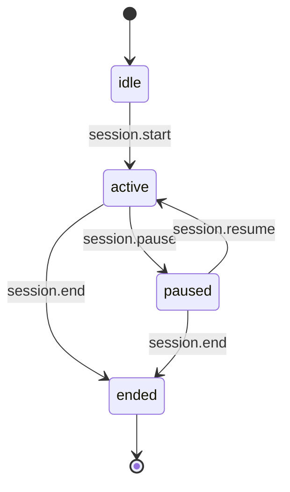
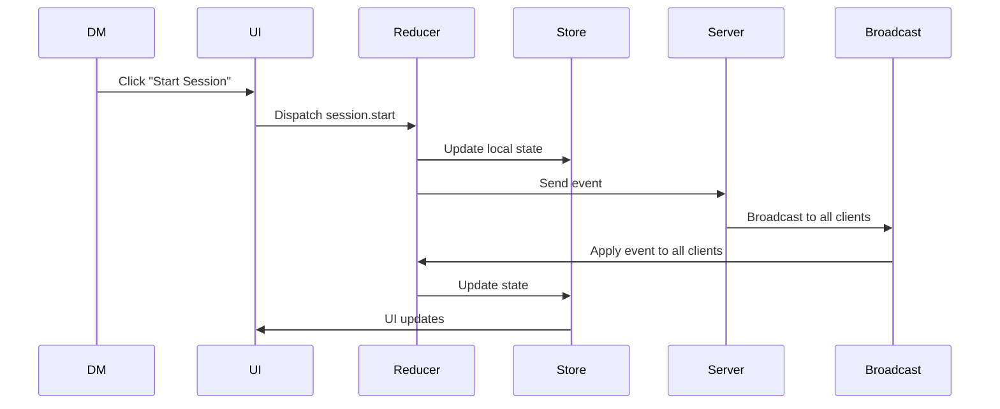

# Session Lifecycle

The Session Lifecycle defines how a tabletop session moves through its various states, how transitions occur, and which actors have authority over those transitions.
It is the authoritative reference for:

- Session state management
- DM controls
- Player visibility
- Event sequencing
- State recovery
- UI behaviour

The lifecycle is intentionally simple, predictable, and resilient to reconnection or transport failures.

---

## 1. Core Principles

### **1.1 Sessions are state machines**

A session always exists in exactly one state.

### **1.2 Only the DM can change session state**

Players and spectators cannot start, pause, resume, or end sessions.

### **1.3 State transitions are event‑driven**

All transitions occur through events such as:

- `session.start`
- `session.pause`
- `session.resume`
- `session.end`

### **1.4 State is recoverable**

Clients can reconnect at any time and reconstruct the current session state.

### **1.5 State is visible to all**

All participants can see the current session state, regardless of role.

---

## 2. Session States

The session state machine consists of four primary states.

### **2.1 idle**

The table exists but no session is running.

- Players may chat
- Notes may be created
- Audio may be triggered
- No session‑specific timers or mechanics are active

---

### **2.2 active**

A session is currently running.

- Presence indicators are active
- Audio effects may be synchronized
- Session‑specific UI is enabled
- DM tools are fully available

---

### **2.3 paused**

The session is temporarily halted.

- Audio may be muted or frozen
- Presence indicators remain active
- UI displays a paused banner
- Players cannot trigger session‑critical actions

The pause reason is **DM‑private**.

---

### **2.4 ended**

The session has concluded.

- Session‑specific UI is disabled
- Audio resets
- Notes remain accessible
- Chat remains open
- A new session may be started

---

## 3. Session Events

All session transitions are triggered by events.

| Event            | Description               | Actor |
| ---------------- | ------------------------- | ----- |
| `session.start`  | Begin a new session       | DM    |
| `session.pause`  | Pause the running session | DM    |
| `session.resume` | Resume a paused session   | DM    |
| `session.end`    | End the session           | DM    |

Events are validated by:

- Role permissions
- Current session state
- Payload schema

Invalid transitions are rejected.

---

## 4. Event Flow

Key points:

- Local state updates immediately for responsiveness
- Server broadcast ensures global consistency
- Reducers guarantee deterministic transitions

---

## 5. UI Behaviour by State

### **idle**

- “Start Session” button visible to DM
- Session timer hidden
- Session controls disabled

### **active**

- Session timer visible
- DM tools enabled
- Player UI fully interactive

### **paused**

- Paused banner visible
- Timer frozen
- Player actions restricted

### **ended**

- Session summary (future)
- Controls reset
- “Start New Session” visible to DM

---

## 6. Presence & Session Interaction

Presence is independent of session state.

Examples:

- A player can be “typing” while the session is paused
- A player can disconnect during an active session
- The DM can override presence regardless of session state

Session state does not override presence; they coexist.

---

## 7. State Recovery

When a client reconnects:

1. The server sends the current session state
2. The client hydrates its Zustand stores
3. Reducers apply any missed events
4. UI renders the correct session state

This ensures:

- No desynchronization
- No stale UI
- No lost session context

---

## 8. Error Handling

Invalid transitions produce:

- A system error event
- A non‑blocking UI notification (DM only)
- No state change

Examples:

- Attempting to pause an idle session
- Attempting to resume an active session
- Attempting to start a session when one is already active

---

## 9. Extension Behaviour

The extension respects session state:

- Overlays may change behaviour when paused
- VTT actions may be disabled during pause
- Session start/end may trigger overlay animations

The extension **cannot** change session state.

---

## 10. Planned Extensions

Planned enhancements:

- Session timeline
- Session playback
- Session metadata (title, theme, tags)
- Multi‑session campaigns
- Session analytics

---

## 11. Summary

The Session Lifecycle ensures:

- Predictable state transitions
- Clear DM authority
- Consistent UI behaviour
- Reliable reconnection
- Deterministic event flow

It is a core architectural pillar of the platform.
