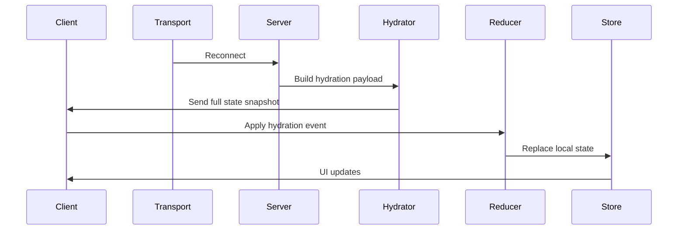

# State Recovery

Status:

- This document describes both planned recovery architecture and the currently shipped Stage 6-7 runtime baseline.
- The shipped runtime currently provides targeted reconnect recovery for room and presence topology plus continued event-driven updates.
- Full cross-domain hydration for chat, notes, audio, permissions, and extension context remains planned architecture rather than verified shipped behavior.

State Recovery defines how a VTT‑Chat client reconstructs its full application state after:

- A network interruption
- A WebSocket reconnect
- A browser refresh
- A tab being suspended
- An extension bridge failure
- A cold start

The goal is to ensure that **every client always has a correct, consistent, and up‑to‑date view of the table**, regardless of connection stability or device behaviour.

State Recovery is a foundational part of the platform’s reliability model.

---

## 1. Core Principles

Current implementation note:

- These principles remain the design target for the platform.
- The shipped baseline currently satisfies them most concretely for transport reconnect, room topology recovery, and presence restoration.
- Full deterministic cross-domain rehydration is not currently implemented.

### **1.1 Recovery must be automatic**

Users should never need to manually refresh or reset.

### **1.2 Recovery must be fast**

Rehydration should complete in under 200ms on a typical connection.

### **1.3 Recovery must be deterministic**

Given the same server state, all clients reconstruct the same local state.

Backend authority requirement:

- After disconnect/reconnect/refresh, backend snapshots + WS events are authoritative.
- Client local cache must be treated as stale until rehydration completes.

### **1.4 Recovery must be complete**

Planned architecture:

- All subsystems should eventually restore:
- Chat
- Notes
- Audio state
- Presence
- Session state
- Extension context

Current shipped baseline:

- Presence and room topology are explicitly refreshed and recovered.
- WebSocket reconnect resumes event-driven updates.
- Audio reconnect can restore durable persisted room environment and DM override state via `GET /api/audio/state/:sessionId`.
- Full chat/notes/audio/permissions/extension hydration is still planned work.

### **1.5 Recovery must be safe**

Recovery must not:

- Leak private data
- Violate permissions
- Replay unauthorized events

---

## 2. Recovery Triggers

Recovery may be triggered when:

- WebSocket reconnects
- Extension bridge reconnects
- Client refreshes
- Client resumes from sleep
- Server requests a rehydrate
- Local state becomes inconsistent

Current shipped baseline most directly covers:

- WebSocket reconnects
- Client reconnect-driven room/presence refresh
- Redis-empty presence restoration from persisted snapshots on the backend
- Backend restarts by rebuilding runtime topology from durable APIs/snapshots
- Redis-backed websocket replay window using reconnect cursors (`lastEventId`) for session-scoped WS events

Multi-device requirement (approved):

- Reconnect behavior must preserve a single visible participant entity while rehydrating multiple device sessions for the same user behind the scenes.

---

## 3. Recovery Lifecycle

Planned architecture lifecycle:



Current shipped Stage 6-7 runtime baseline is narrower:

1. **Reconnect detected**
   Transport layer reconnects with backoff.

2. **Server re-associates connection**
   Authentication and connection state are restored.

3. **Backend restores presence if needed**
   Presence snapshots may be used when realtime state is empty.

4. **Frontend refreshes targeted topology**
   Room and presence state are reloaded and atomically replaced.

5. **Domain events continue flowing**
   Normal websocket event dispatch resumes after reconnect.

6. **If backend restarts, clients rehydrate from APIs**
   Runtime continuity depends on durable records (for example presence snapshots and Postgres-backed domain state), then websocket updates continue from the new process.

7. **Reconnect replay window (bounded)**
   Client auth now includes optional `lastEventId`; server can replay recent session events from Redis stream before normal live flow resumes.

8. **Device-session reconciliation (required for multi-device)**
   Server reconciles WS-connected devices, runtime mic-owner pointer, and media publish state before allowing new publish transitions.

### **Lifecycle Stages**

1. **Reconnect detected**
   Transport layer signals reconnection.

2. **Server builds hydration payload**
   Server compiles the canonical state snapshot.

3. **Client receives hydration event**
   A special event: `system.state.hydrate`.

4. **Reducer applies hydration**
   Local state is replaced with server state.

5. **UI re-renders**
   All components update based on the new state.

---

## 4. Hydration Payload Structure

Planned architecture:

- A future full hydration payload may provide a complete snapshot of all relevant state.
- This is not yet the shipped Stage 6-7 runtime contract.

```json
{
  "session": { ... },
  "presence": { ... },
  "chat": { ... },
  "notes": { ... },
  "audio": { ... },
  "permissions": { ... },
  "extension": { ... }
}
```

Current shipped baseline:

- No general `system.state.hydrate` event contract is currently shipped.
- Recovery today is composed from reconnect handling, room/presence API refresh, and ongoing websocket domain events.

### **4.1 Session State**

- Current session state
- Pause reason (DM only)
- Lock state

### **4.2 Presence State**

- Online users
- Speaking/typing indicators
- Avatars

### **4.3 Chat State**

- Recent messages
- System messages
- Whisper visibility rules

### **4.4 Notes State**

- Shared notes
- Private notes (creator only)

### **4.5 Audio State**

- Active effects
- Preset state
- Mute states

### **4.6 Permissions**

- Role
- Capabilities
- Restrictions

### **4.7 Extension Context**

- VTT scene (if supported)
- Token selection (if supported)

---

## 5. Reducer Behaviour During Hydration

Planned architecture:

- Full hydration is intended to be handled by a dedicated reducer.
- That reducer contract is not yet the shipped runtime baseline.

```text
systemReducer.hydrate(payload)
```

Rules:

- Hydration **replaces** local state
- Hydration does **not** merge state
- Hydration is **atomic**
- Hydration is **pure**
- Hydration must not throw

If hydration fails:

- Local state resets
- Client requests a new hydration payload

Current shipped baseline instead relies on:

- reconnect-safe websocket dispatch
- targeted API refresh for room and presence state
- store-level atomic replacement for room/presence topology

For multi-device support, hydration must additionally:

- Restore device-session roster for the authenticated user.
- Restore current mic-owner selection for that user.
- Force local hard-unpublish if this device is no longer mic owner.

---

## 6. Event Replay (Future)

The architecture supports future event replay:

- Server stores event logs
- Client replays events since last known timestamp
- Ensures perfect determinism

Current shipped baseline:

- A bounded replay baseline is implemented for websocket session events using Redis stream storage and reconnect cursor (`lastEventId`) handling.
- Replay is limited to recent retained events; it is not a full historical/event-sourcing replay system.
- Full deterministic replay across all domains remains future architecture.

Current implementation note:

- `apps/backend/src/ws/state-recovery.ts` now has both in-memory replay helpers (legacy/tests) and Redis durable replay helpers for restart-safe reconnect windows (`ws:session:{sessionId}:events`).
- After restart, clients rely on both targeted API rehydration and bounded Redis replay when cursor history is available.

---

## 6.1 Background Job Recovery (Future)

Long-running backend tasks (for example cleanup transitions, transcription, and summary generation)
must recover safely from process restarts and transient failures.

Recovery requirements for async jobs:

- Job envelopes are durable and survive service restarts.
- Interrupted jobs resume from persisted checkpoints when available.
- Retry behavior is bounded and visible (with DLQ for terminal failures).
- Status hydration after reconnect/refresh comes from backend-persisted job status,
  not in-memory worker state.

Design references:

- [QUEUE-JOB-MANAGER.md](docs/architecture/QUEUE-JOB-MANAGER.md)
- [TRANSCRIPTION-RECORDING-SYSTEM.md](docs/architecture/TRANSCRIPTION-RECORDING-SYSTEM.md)

---

## 7. Subsystem Recovery Rules

Each subsystem has specific recovery behaviour.

---

### 7.1 Chat Recovery

Planned architecture:

- Loads recent messages
- Restores whisper visibility
- Restores system messages
- Does not replay old messages

Current shipped baseline:

- Chat continues as an event-driven domain after reconnect.
- Full chat snapshot hydration is not yet the shipped contract.
- Client may maintain a local outgoing send queue for UX (`queued`/`sending`/`failed`), but persisted chat order/content remains backend + WS authoritative.

### 7.2 Multi-device recovery and transfer rules (approved)

1. **One visible user, many devices**
   Presence recovery remains user-scoped for DM/player views; device-scoped state is private to the authenticated user.

2. **Mic owner recovery**
   On reconnect, server state for mic owner is authoritative. If device publish state disagrees, client must hard-unpublish immediately.

3. **Transfer mode recovery**
   Transfer is immediate and silent. Old device receives forced disconnect and must route to campaign screen (or logout for guest users).

4. **Spectator restriction**
   Spectators are single-device only. Additional spectator device connection attempts must require `Transfer` or `Cancel`.

5. **Consistency channel requirement**
   LiveKit webhooks are accepted as one source of truth, but recovery must reconcile webhook-derived publish state with backend runtime snapshots/events after refresh/reconnect.

- After backend restart, chat continuity is restored from durable APIs (Postgres-backed history) rather than Redis event-stream replay.

---

### 7.2 Notes Recovery

Planned architecture:

- Restores shared notes
- Restores private notes (creator only)
- Ensures visibility rules are enforced

Current shipped baseline:

- Notes remain governed by runtime visibility rules.
- Full notes snapshot hydration is not yet the shipped contract.

---

### 7.3 Audio Recovery

Planned architecture:

- Restores active effects
- Restores mute states
- Restores preset state
- Does not replay sound effects

Current shipped baseline:

- LiveKit token issuance, connection hooks, and realtime audio control events are implemented.
- Durable persisted recovery of room-scoped environment state and DM overrides is implemented.
- Audio reconnect/recovery currently restores room environment and DM override state; broader full snapshot-based cross-domain restore remains planned.

Connected-room cue rule:

- The effective environment/effect projection must follow the currently connected voice room, not merely selected UI room.
- If no connected room exists, or connected room is private/greenroom context, effective environment must clear to neutral/default.

---

### 7.4 Presence Recovery

- Rebuilds presence list
- Resets speaking/typing indicators
- Re-establishes heartbeat

Current shipped baseline:

- Presence recovery is the most complete shipped subsystem recovery path.
- Backend can recover session presence from persisted snapshots when realtime state is empty.
- Frontend reconnect refresh replaces room and presence topology atomically.
- This path is validated by `apps/backend/tests/integration/room-service-recovery.integration.test.ts`.

---

### 7.5 Session Recovery

Planned architecture:

- Restores session state
- Restores pause state
- Restores lock state

Current shipped baseline:

- Session lifecycle continues through normal APIs and event dispatch.
- Full session snapshot hydration is not yet a general recovery contract.

---

### 7.6 Extension Recovery

Planned behavior; not part of the shipped Stage 0-7 runtime baseline.

---

## 8. Error Handling

If hydration fails:

- Local state resets
- Client requests a new hydration payload
- UI shows a non-blocking “Re-syncing…” banner

If repeated failures occur:

- Client enters safe mode
- Only minimal UI is shown
- User is prompted to refresh

---

## 9. Security & Privacy

Hydration must never include:

- Other players’ private notes
- DM-private data (unless DM)
- System-private data
- Unauthorized whispers

Payloads are filtered based on role and permissions.

---

## 10. Performance Requirements

Hydration must:

- Complete in <200ms
- Use minimal payload size
- Avoid redundant data
- Avoid deep nesting
- Use stable keys

---

## 11. Summary

State Recovery ensures that:

- Clients always have correct state
- Reconnects are seamless
- UI remains consistent
- Privacy is preserved
- Reducers remain deterministic
- Transport failures are non-fatal

It is a critical part of the platform’s reliability and user experience.
