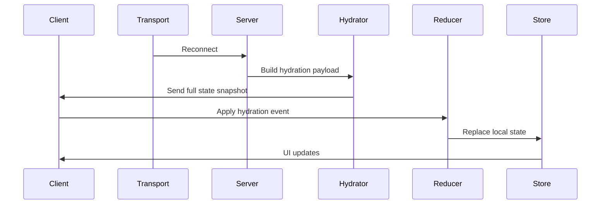

# **STATE-RECOVERY.md**

# State Recovery

State Recovery defines how a VTT‑Chat client reconstructs its full application state after:

- A network interruption
- A WebSocket reconnect
- A browser refresh
- A tab being suspended
- An extension bridge failure
- A cold start

The goal is to ensure that **every client always has a correct, consistent, and up‑to‑date view of the table**, regardless of connection stability or device behaviour.

State Recovery is a foundational part of the platform’s reliability model.

---

# 1. Core Principles

### **1.1 Recovery must be automatic**

Users should never need to manually refresh or reset.

### **1.2 Recovery must be fast**

Rehydration should complete in under 200ms on a typical connection.

### **1.3 Recovery must be deterministic**

Given the same server state, all clients reconstruct the same local state.

### **1.4 Recovery must be complete**

All subsystems must restore:

- Chat
- Notes
- Audio state
- Presence
- Session state
- Extension context

### **1.5 Recovery must be safe**

Recovery must not:

- Leak private data
- Violate permissions
- Replay unauthorized events

---

# 2. Recovery Triggers

State Recovery is triggered when:

- WebSocket reconnects
- Extension bridge reconnects
- Client refreshes
- Client resumes from sleep
- Server requests a rehydrate
- Local state becomes inconsistent

---

# 3. Recovery Lifecycle



### **Lifecycle Stages**

1. **Reconnect detected**
   Transport layer signals reconnection.

2. **Server builds hydration payload**
   Server compiles the canonical state snapshot.

3. **Client receives hydration event**
   A special event: `system.state.hydrate`.

4. **Reducer applies hydration**
   Local state is replaced with server state.

5. **UI re-renders**
   All components update based on the new state.

---

# 4. Hydration Payload Structure

The hydration payload is a complete snapshot of all relevant state.

```json
{
  "session": { ... },
  "presence": { ... },
  "chat": { ... },
  "notes": { ... },
  "audio": { ... },
  "permissions": { ... },
  "extension": { ... }
}
```

### **4.1 Session State**

- Current session state
- Pause reason (DM only)
- Lock state

### **4.2 Presence State**

- Online users
- Speaking/typing indicators
- Avatars

### **4.3 Chat State**

- Recent messages
- System messages
- Whisper visibility rules

### **4.4 Notes State**

- Shared notes
- Private notes (creator only)

### **4.5 Audio State**

- Active effects
- Preset state
- Mute states

### **4.6 Permissions**

- Role
- Capabilities
- Restrictions

### **4.7 Extension Context**

- VTT scene (if supported)
- Token selection (if supported)

---

# 5. Reducer Behaviour During Hydration

Hydration is handled by a dedicated reducer:

```
systemReducer.hydrate(payload)
```

Rules:

- Hydration **replaces** local state
- Hydration does **not** merge state
- Hydration is **atomic**
- Hydration is **pure**
- Hydration must not throw

If hydration fails:

- Local state resets
- Client requests a new hydration payload

---

# 6. Event Replay (Future)

The architecture supports future event replay:

- Server stores event logs
- Client replays events since last known timestamp
- Ensures perfect determinism

This is not yet implemented but the Event Bus is designed for it.

---

# 7. Subsystem Recovery Rules

Each subsystem has specific recovery behaviour.

---

## 7.1 Chat Recovery

- Loads recent messages
- Restores whisper visibility
- Restores system messages
- Does not replay old messages

---

## 7.2 Notes Recovery

- Restores shared notes
- Restores private notes (creator only)
- Ensures visibility rules are enforced

---

## 7.3 Audio Recovery

- Restores active effects
- Restores mute states
- Restores preset state
- Does not replay sound effects

---

## 7.4 Presence Recovery

- Rebuilds presence list
- Resets speaking/typing indicators
- Re-establishes heartbeat

---

## 7.5 Session Recovery

- Restores session state
- Restores pause state
- Restores lock state

---

## 7.6 Extension Recovery

- Re-injects overlay
- Re-establishes bridge connection
- Re-syncs scene/token context (if supported)

---

# 8. Error Handling

If hydration fails:

- Local state resets
- Client requests a new hydration payload
- UI shows a non-blocking “Re-syncing…” banner

If repeated failures occur:

- Client enters safe mode
- Only minimal UI is shown
- User is prompted to refresh

---

# 9. Security & Privacy

Hydration must never include:

- Other players’ private notes
- DM-private data (unless DM)
- System-private data
- Unauthorized whispers

Payloads are filtered based on role and permissions.

---

# 10. Performance Requirements

Hydration must:

- Complete in <200ms
- Use minimal payload size
- Avoid redundant data
- Avoid deep nesting
- Use stable keys

---

# 11. Summary

State Recovery ensures that:

- Clients always have correct state
- Reconnects are seamless
- UI remains consistent
- Privacy is preserved
- Reducers remain deterministic
- Transport failures are non-fatal

It is a critical part of the platform’s reliability and user experience.
