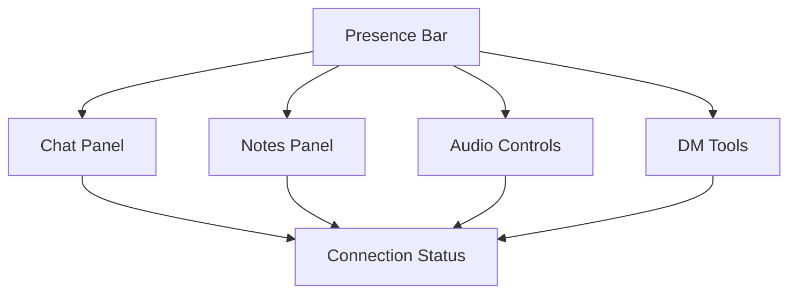

# Extension UX

The Extension UX defines how the VTT‑Chat browser extension behaves when injected into a third‑party Virtual Tabletop (VTT).
It describes the user experience principles, interaction patterns, overlay behaviour, and role‑aware UI rules that ensure the extension is:

- Non‑intrusive
- Predictable
- VTT‑agnostic

**Note:** This document focuses on **user experience** and overlay behavior.
For technical implementation details, see [EXTENSION-INTEGRATION.md](EXTENSION-INTEGRATION.md).

- Privacy‑respecting
- DM‑aware
- Consistent with the core app

This document focuses on **user experience**, not technical implementation.

---

## 1. UX Philosophy

### **1.1 Overlay‑First**

The extension never modifies the VTT’s UI directly.
All interactions occur through a **self‑contained overlay**.

### **1.2 Non‑Destructive**

The extension must not:

- Break VTT functionality
- Override VTT controls
- Interfere with VTT event handlers
- Inject global CSS that affects the host

### **1.3 Role‑Aware**

The overlay adapts to:

- DM
- Player

Each role sees only what they are allowed to see.

> **Note:** Spectators do not use the browser extension. Spectators access the session through the web-based spectator invite page (`/watch/:code`). The extension is for players and DMs only.

### **1.4 Privacy‑Respecting**

The extension must never expose:

- Private notes
- DM‑only data
- Whisper contents
- System‑private information

### **1.5 Predictable**

The overlay behaves consistently across all VTTs.

---

## 2. Overlay Layout

The overlay is composed of modular UI regions:



### **2.1 Presence Bar**

Displays:

- User avatars
- Speaking indicators
- Typing indicators
- Connection status

### **2.2 Chat Panel**

Supports:

- IC/OOC messages
- Whispers
- System messages

### **2.3 Notes Panel**

Supports:

- Private notes
- Shared notes

### **2.4 Audio Controls**

Supports:

- Triggering effects
- Applying presets (DM only)
- Local volume controls

### **2.5 DM Tools**

Visible only to the DM:

- Session controls
- Presence overrides
- Audio overrides
- VTT actions (if supported)

---

## 3. Interaction Patterns

### **3.1 Click‑Through by Default**

The overlay must allow the user to interact with the VTT beneath it unless:

- A panel is open
- A modal is active
- A drag operation is in progress

### **3.2 Dockable Panels**

Panels may be:

- Docked
- Undocked
- Collapsed
- Resized

### **3.3 Non‑Blocking UI**

The overlay must never block:

- Token movement
- Map interaction
- VTT menus

### **3.4 Context‑Aware Behaviour**

Examples:

- When a token is selected, the overlay may show token‑related actions
- When the DM switches scenes, the overlay updates context

---

## 4. Role‑Based UX

---

### 4.1 DM UX

DMs see:

- DM tools
- Session controls
- Audio presets
- Presence overrides
- VTT actions (if supported)

DMs do **not** see:

- Player private notes

---

### 4.2 Player UX

Players see:

- Chat
- Notes
- Audio controls
- Presence

Players do **not** see:

- DM tools
- Session controls
- Other players’ private notes

---

> **Spectators** are not extension users. They connect via the web-based spectator invite page (`/watch/:code`). A user who started as a spectator may transition to a player or DM by:
>
> - **Registering a full account** using the same email address provided when joining as a spectator. Email verification confirms ownership and links the existing session history to the new account.
> - **Joining via a player invite link** — the backend matches on email; if the email on the player invite matches an existing spectator account, the accounts are merged after email verification.

---

## 5. Overlay States

The overlay has several states depending on connection and session status.

---

### 5.1 Connected

- Full UI available
- Presence active
- Chat live
- Notes synced

---

### 5.2 Reconnecting

- UI dims
- “Reconnecting…” banner
- Local state preserved
- No actions allowed

---

### 5.3 Disconnected

- UI disabled
- Error message shown
- Retry button

---

### 5.4 Paused Session

- Paused banner
- Session‑critical actions disabled
- Chat and notes still available

---

## 6. Motion & Animation

The overlay follows the global Motion Spec:

- Subtle transitions
- No distracting animations
- Motion reinforces state changes
- Panels animate in/out smoothly
- Presence indicators pulse gently

---

## 7. VTT Interaction UX

The overlay interacts with the VTT in a **safe, predictable** way.

### **7.1 Token Awareness**

If supported:

- Selecting a token highlights related UI
- DM may trigger token‑related actions

### **7.2 Scene Awareness**

If supported:

- Overlay updates when scenes change
- DM may trigger scene actions

### **7.3 Macro Actions**

If supported:

- DM may trigger macros
- Players may trigger allowed macros

### **7.4 Map Interaction**

The overlay must never block:

- Panning
- Zooming
- Token dragging

---

## 8. Error UX

Errors must be:

- Non‑blocking
- Role‑appropriate
- Sanitized
- Recoverable

Examples:

- “Unable to read token data”
- “VTT API unavailable”
- “Overlay injection failed”

DMs may see more detail.

---

## 9. Accessibility

The overlay must support:

- Keyboard navigation
- Screen reader compatibility
- High‑contrast mode (future)
- Adjustable font sizes (future)

---

## 10. Extension Popup — DM States

The extension popup renders different UIs depending on whether the page is a DDB campaign page and whether the logged-in user owns the campaign.

> Full DM link flow specification (first-time link, returning launch, invite code handling) is in [DM-LINK.md](DM-LINK.md). This section covers the visible UX only.

### 10.1 Not on a DDB Campaign Page

Standard popup: server selector, last-used campaign summary, player Launch button if a credential is stored.

### 10.2 On a DDB Campaign Page — User Is Not a Member

```text
┌─────────────────────────────────────────────────────┐
│  VTT-Chat                                  [×]      │
│                                                     │
│  📋  The Lost Mines of Phandelver                   │
│      You are not a member of this campaign          │
│                                                     │
│  Ask the DM for a player invite link.               │
└─────────────────────────────────────────────────────┘
```

### 10.3 On a DDB Campaign Page — User Is a Player (Not DM)

Standard player launch UI — enter invite code, or launch if credential is stored. Not shown here (existing flow, no change).

### 10.4 On a DDB Campaign Page — User Is the DM, Not Yet Linked

```text
┌─────────────────────────────────────────────────────┐
│  VTT-Chat                                  [×]      │
│                                                     │
│  📋  The Lost Mines of Phandelver                   │
│      You are the DM of this campaign                │
│                                                     │
│  Enter your VTT-Chat invite code to link:           │
│  ┌────────────────────────────────────────────────┐ │
│  │  abc123...                              [✓]    │ │
│  └────────────────────────────────────────────────┘ │
│  ✓ "The Lost Mines of Phandelver"                   │
│                                                     │
│  [ Link & Launch as DM ]                            │
│                                                     │
│  ────────────────────────────────────────────────   │
│  Not the DM? → Launch as player instead             │
└─────────────────────────────────────────────────────┘
```

- The invite code input validates on blur; the campaign name confirmation appears below the field on success.
- "Link & Launch as DM" is disabled until the code is valid.
- "Not the DM?" link switches the popup to the player branch.

### 10.5 On a DDB Campaign Page — Returning DM (Campaign Linked)

```text
┌─────────────────────────────────────────────────────┐
│  VTT-Chat                                  [×]      │
│                                                     │
│  📋  The Lost Mines of Phandelver                   │
│      ✓ Linked  ·  You are the DM                    │
│                                                     │
│  🟢 2 players online  ·  Session: Active            │
│                                                     │
│  [ Launch as DM ]          [ Sync Campaign ]        │
│                                                     │
└─────────────────────────────────────────────────────┘
```

- Session status is fetched from `GET /api/campaigns/:campaignId/session-status`.
- **Sync Campaign** shows a spinner during the sync and a brief success/error toast on completion.
- Error toast copy: _"Sync failed — check your connection and try again."_

### 10.6 /ext-launch DM-Link Page

This page is opened by the extension when the DM clicks **Link & Launch as DM** for the first time. It is a minimal authenticated handoff page — not the main campaign workspace.

| Element           | Detail                                                                                                                               |
| ----------------- | ------------------------------------------------------------------------------------------------------------------------------------ |
| Heading           | "Log in to link your DM account"                                                                                                     |
| Sub-heading       | "Enter your vtt-chat password to link this campaign to your DDB account."                                                            |
| Email field       | Pre-filled from DDB profile email; read-only                                                                                         |
| Password field    | Standard password input                                                                                                              |
| Submit button     | "Log in & Link"                                                                                                                      |
| Error state       | Inline error below password field; submit re-enabled                                                                                 |
| Identity conflict | Separate error block: _"This DDB account is already linked to a different vtt-chat login. Please contact support."_ No retry offered |

After successful login and dm-link call, the page redirects to the campaign workspace. The browser tab that was opened by the extension becomes the active campaign tab.

---

## 11. Planned Enhancements

Planned improvements:

- Token action bar
- Scene timeline
- GM layer visibility (if supported)
- Macro palette
- Overlay themes
- Multi‑monitor support

---

## 11. Summary

The Extension UX ensures that the overlay is:

- Safe
- Predictable
- Role‑aware
- Privacy‑respecting
- VTT‑agnostic
- Non‑intrusive
- Consistent with the core app

It provides a unified, stable user experience across all supported VTTs.
