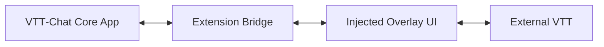
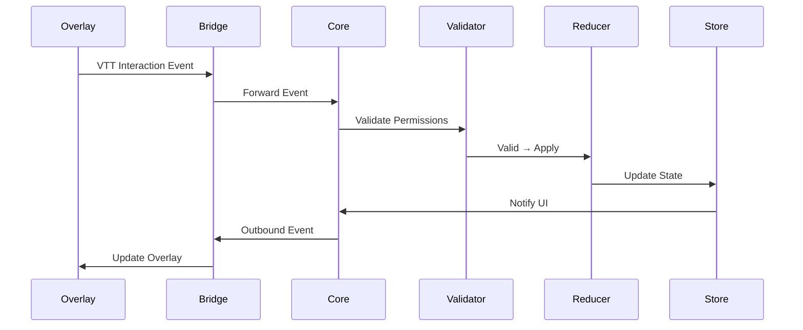

# Third‑Party Integrations

This document defines how VTT‑Chat integrates with external Virtual Tabletops (VTTs) such as D&D Beyond, Roll20, Foundry VTT, Fantasy Grounds, Owlbear Rodeo, and others.
It describes the integration model, extension behaviour, DOM interaction rules, event flow, safety boundaries, third-party system separation, and platform admin authorization controls.

**Related docs:**

- [GUEST-AUTH.md](GUEST-AUTH.md) — guest/invite-link auth flow and external identity model
- [EXTENSION-INTEGRATION.md](EXTENSION-INTEGRATION.md) — extension architecture and communication

The goal is to provide a **consistent, VTT‑agnostic integration layer** that:

- Works across multiple platforms
- Respects privacy and permissions
- Avoids breaking the host VTT
- Provides predictable behaviour
- Is easy to extend
- Keeps each external system isolated from others

---

## 1. Integration Philosophy

### **1.1 Non‑intrusive**

The extension must never break or modify core VTT functionality.

### **1.2 Overlay‑first**

VTT‑Chat interacts with the VTT primarily through an injected overlay, not by modifying the VTT UI.

### **1.3 DOM‑safe**

The extension must:

- Avoid mutating VTT DOM structures
- Avoid interfering with VTT event handlers
- Avoid injecting global CSS that affects the host

### **1.4 Permission‑aware**

The extension respects:

- DM authority
- Player privacy
- Role boundaries
- Capability restrictions

### **1.5 VTT‑agnostic**

Integrations must not rely on:

- Specific DOM structures
- Proprietary APIs
- Fragile selectors

Where possible, integrations use:

- Stable hooks
- Public APIs
- Overlay‑based interactions

---

## 2. Integration Architecture

The integration model consists of three layers:



### **2.1 Core App**

The main VTT‑Chat application:

- Manages state
- Handles events
- Applies permissions
- Drives UI

### **2.2 Extension Bridge**

A communication layer that:

- Sends events between the core app and the overlay
- Normalizes VTT interactions
- Enforces privacy and permissions
- Provides a stable API for integrations

### **2.3 Overlay**

A DOM‑injected UI layer that:

- Renders chat, notes, audio controls, presence, etc.
- Interacts with the VTT through safe, sandboxed operations
- Never modifies VTT internals

### **2.4 VTT**

The host platform.

---

## 3. Integration Capabilities

The extension supports a limited set of VTT interactions.

---

### 3.1 Read‑Only Capabilities

These are safe for all roles:

- Read map position
- Read selected token
- Read scene metadata
- Read player list
- Read chat log (if allowed by VTT)

These operations must:

- Be sandboxed
- Never expose private VTT data
- Respect VTT permissions

---

### 3.2 DM‑Only Capabilities

These require DM authority:

- Trigger VTT pings
- Highlight tokens
- Change scene (if supported)
- Read GM‑layer metadata (if supported)
- Trigger VTT macros (if supported)

These actions must be:

- Explicit
- Logged
- Permission‑checked

---

### 3.3 Unsupported Capabilities

The extension must **never**:

- Modify VTT core files
- Inject scripts into the VTT runtime
- Override VTT event handlers
- Access GM‑private data without explicit VTT support
- Manipulate VTT network traffic

---

## 4. Event Flow

All VTT interactions flow through the Event Bus.



---

## 5. Integration Modes

The extension supports multiple integration modes depending on VTT capabilities.

---

### 5.1 Overlay‑Only Mode (Universal)

Works on all VTTs.

Capabilities:

- Overlay UI
- Presence
- Chat
- Notes
- Audio
- Local token tracking (if detectable)

No deep VTT integration required.

---

### 5.2 API‑Enhanced Mode (VTT‑Specific)

Used when a VTT exposes:

- Public APIs
- WebSocket endpoints
- Macro systems
- Event hooks

Examples:

- Foundry VTT API
- Roll20 API (Pro users)

Capabilities:

- Token selection sync
- Scene sync
- Macro triggers
- GM layer visibility (if allowed)

---

### 5.3 DOM‑Assisted Mode (Fallback)

Used when:

- No API exists
- No event hooks exist
- Minimal DOM structure is available

Capabilities:

- Read token names
- Detect selected elements
- Detect scene changes

DOM access must be:

- Read‑only
- Selector‑safe
- Non‑destructive

---

## 6. VTT Compatibility Matrix

| VTT                | Overlay Mode | API Mode | DOM Mode | Notes               |
| ------------------ | ------------ | -------- | -------- | ------------------- |
| Foundry VTT        | ✔            | ✔        | ✔        | Best integration    |
| Roll20             | ✔            | Limited  | ✔        | API requires Pro    |
| Fantasy Grounds    | ✔            | ✖        | Limited  | Closed architecture |
| Owlbear Rodeo      | ✔            | ✖        | Limited  | Lightweight VTT     |
| Tabletop Simulator | ✔            | ✖        | Limited  | Requires scripting  |

---

## 7. Privacy & Permissions

The extension must enforce:

- Player privacy
- DM authority
- Capability restrictions
- Session state rules

Examples:

- Players cannot trigger GM‑only macros
- Spectators cannot interact with the VTT
- Private notes never leave the core app
- DM‑private data is never exposed to the overlay

---

## 8. Error Handling

Integration errors must:

- Fail gracefully
- Never break the VTT
- Never break the overlay
- Never expose internal errors to the VTT

Examples:

- DOM element not found
- API call rejected
- Macro not available
- Scene not accessible

---

## 9. Planned Integrations

Planned enhancements:

- Foundry VTT deep integration module
- Roll20 macro bridge
- Owlbear Rodeo scene sync
- Tabletop Simulator scripting helpers
- Universal token tracking layer

---

## 10. Third-Party System Separation

Each external system is treated as an isolated identity namespace. Data from one system cannot bleed into another system's identity records.

### 10.1 System Isolation Model

- A vtt-chat user may have identity records from multiple external systems (e.g. both D&D Beyond and Roll20).
- External identities are linked at the user level by **email address** — the same email across two systems resolves to the same vtt-chat user.
- Campaign links from different external systems are stored separately. One vtt-chat campaign may be linked to a DDB campaign **and** a Roll20 campaign simultaneously, but each link is scoped to its originating system.
- Character records carry their `externalSystem` and `externalId` tags and are never merged across systems.

### 10.2 Supported Systems

| System              | Identifier       | Auth-capable | Log ingestion | Metadata sync |
| ------------------- | ---------------- | ------------ | ------------- | ------------- |
| **D&D Beyond**      | `dndbeyond`      | Yes          | Yes           | Yes           |
| **Roll20**          | `roll20`         | Planned      | Yes           | Planned       |
| **Foundry VTT**     | `foundry`        | Planned      | Yes           | Planned       |
| **Fantasy Grounds** | `fantasygrounds` | No           | Planned       | No            |
| **Owlbear Rodeo**   | `owlbear`        | No           | Planned       | No            |

"Auth-capable" means the system can be used for guest login via the extension. Systems that are not auth-capable can still contribute log ingestion.

### 10.3 System Identifiers

Each system uses a stable lowercase string identifier (the `externalSystem` enum value). These identifiers appear in:

- `ExternalIdentity.externalSystem`
- `Character.externalSystem`
- `CampaignExternalLink.externalSystem`
- API request bodies (`externalSystem` field)

Adding a new system requires adding to the enum and registering the system in the platform admin panel.

---

## 11. Platform Admin: System Authorization

The platform admin (system operator) controls which external systems are permitted to authenticate users or ingest data. This is independent of the DM's per-campaign sync policy.

### 11.1 Authorization States

| State        | Label              | Effect                                                   |
| ------------ | ------------------ | -------------------------------------------------------- |
| `AUTHORIZED` | Authorized         | System can be used for guest auth and data ingestion     |
| `LOG_ONLY`   | Log ingestion only | System can submit logs but cannot be used for guest auth |
| `BLOCKED`    | Blocked            | All requests from this system are rejected               |

Default for new registered systems: `BLOCKED` (must be explicitly authorized).

### 11.2 Admin API

```text
GET  /admin/api/integrations/systems
POST /admin/api/integrations/systems/:system/authorize
POST /admin/api/integrations/systems/:system/block
PATCH /admin/api/integrations/systems/:system
```

`GET` returns all registered systems and their current authorization state.

`PATCH` allows updating:

- `authorizationState`
- `displayName`
- `notes` (admin-visible only)
- `allowedScopes` (e.g. `auth`, `log_ingestion`, `metadata_sync`)

### 11.3 Admin Panel

The admin panel (in the `admin/` application) exposes a **Integrations** section showing:

- All registered external systems
- Current authorization state
- Activity metrics (total users from each system, last seen)
- Controls to authorize, restrict to log-only, or block each system

### 11.4 Request Rejection

When the extension submits a request from a blocked or unrecognized system:

```text
POST /api/auth/extension/guest-login
  → 403 { "code": "INTEGRATION_NOT_AUTHORIZED", "message": "..." }
```

The extension popup must display a user-friendly message such as: "This platform has not enabled [System Name] integration."

### 11.5 Audit Logging

All authorization state changes are logged in the platform audit log with:

- Admin user ID
- System identifier
- Previous state → new state
- Timestamp

---

## 12. Summary

The third‑party integration model is:

- Safe
- Predictable
- VTT‑agnostic
- Extensible
- Privacy‑respecting
- DM‑aware
- System-isolated (each external VTT is a separate namespace)
- Admin-controlled (platform operator authorizes or blocks systems)

It ensures VTT‑Chat can integrate with any VTT without compromising stability or trust.
